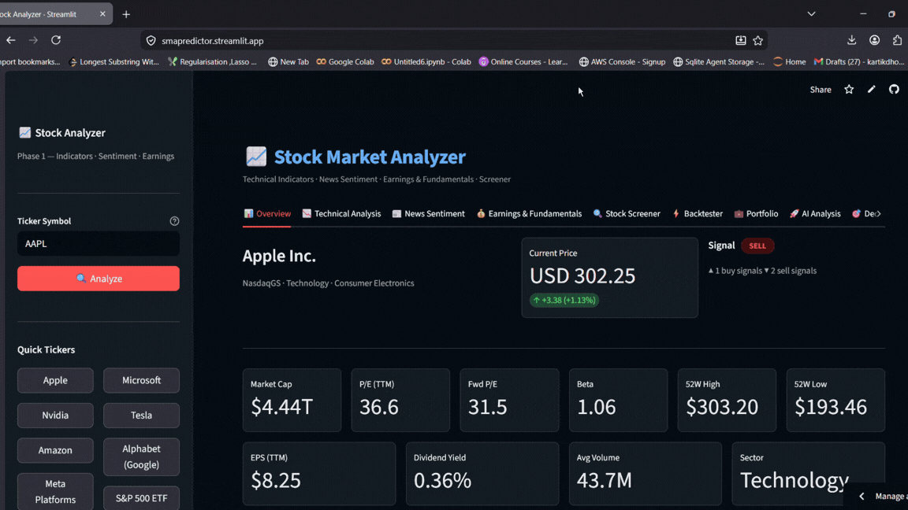

# Stock Market Predictor and analyser
Stock market prediction is not an easy task it requires a lot of metrics, news consideration and statistics there may be more other things than this also that helps to get ideas about stock market but stock prediction is a probability; we cant guarantee that stock price will really go up or down, when to purchase or predict. Here i created a Stock Market Predictor and analyzer that doesn't just predict much more. it analyzes the market using trends, current news regarding the stock and many more and considering this metrics i created an app which will help for analysis and then we get a probablity for market changes according to this data.

> A production-grade stock analysis and decision support platform built across 3 phases.
> Combines technical indicators, global macro sentiment, probabilistic forecasting, backtesting, and portfolio optimization into one unified tool.

**[Live Demo →](https://smapredictor.streamlit.app)** &nbsp;|&nbsp; **[API Docs →](http://54.237.238.233:8000/docs)** &nbsp;|&nbsp; **[Development Journey →](./JOURNEY.md)**

---



## Architecture

```
Streamlit Frontend (Streamlit Cloud - Free)
        ↕ HTTP/REST
FastAPI Backend (AWS EC2 t3.micro - Free Tier)
        ↕
Free Data Sources:
  yfinance    → price, earnings, news
  Reuters RSS → global macro news  
  BBC RSS     → world news
  AP News RSS → breaking news
  CNBC RSS    → market news
```

---

## Features

### Phase 1 — Analysis Engine
| Feature | Description |
|---|---|
| **Overview** | Price, market cap, P/E, beta, 52-week range, EPS, dividend yield |
| **Technical Analysis** | RSI, MACD, Bollinger Bands, MA Cross, Stochastic, ATR, OBV |
| **News Sentiment** | Yahoo Finance RSS headlines scored with VADER |
| **Earnings** | Quarterly EPS actual vs estimate, revenue, analyst consensus |
| **Stock Screener** | Batch scan watchlists by RSI range and signal type |

### Phase 2 — Backtesting & Portfolio
| Feature | Description |
|---|---|
| **Backtester** | 6 strategies, Sharpe/Sortino/MaxDD/Calmar, walk-forward validation |
| **Portfolio Optimizer** | Efficient frontier, Max Sharpe, Min Volatility, Risk Parity |

### Phase 3 — AI & Decision Engine
| Feature | Description |
|---|---|
| **Regime Detection** | GaussianMixture → Bull / Bear / High Volatility / Consolidation |
| **Probabilistic Forecast** | EWMA-GARCH + ARIMA + Bootstrap Monte Carlo fan chart |
| **Ensemble Score** | 7 indicators with regime-adaptive weights → 0–100 score |
| **Global Macro Sentiment** | Reuters/BBC/AP/CNBC → relevance-scored to each sector |
| **Decision Engine** | All signals → BUY/HOLD/SELL + entry zone, stop loss, take profit |

---

## Tech Stack

```
Backend:   FastAPI, yfinance, pandas, numpy, scikit-learn, statsmodels, scipy, vaderSentiment
Frontend:  Streamlit, Plotly, requests
Infra:     AWS EC2 t3.micro, Streamlit Community Cloud, GitHub
```

---

## Quick Start (Local)

```bash
# Backend
cd backend
python -m venv venv && venv\Scripts\activate
pip install -r requirements.txt
uvicorn main:app --reload --port 8000

# Frontend (new terminal)
cd frontend
python -m venv venv && venv\Scripts\activate
pip install -r requirements.txt
streamlit run app.py
# Set BACKEND_URL=http://localhost:8000 in environment
```

---

## API Endpoints

| Endpoint | Description |
|---|---|
| `GET /health` | Health check |
| `GET /info/{ticker}` | Stock overview |
| `GET /indicators/{ticker}` | Technical analysis |
| `GET /sentiment/{ticker}` | News sentiment |
| `GET /earnings/{ticker}` | Earnings data |
| `POST /screen` | Batch screener |
| `POST /backtest` | Strategy backtesting |
| `POST /portfolio/optimize` | Portfolio optimization |
| `GET /analysis/{ticker}` | AI analysis (Phase 3) |
| `GET /decide/{ticker}` | Decision engine |
| `GET /macro/{ticker}` | Global macro sentiment |

Interactive docs: `http://54.237.238.233:8000/docs`

---

## Project Structure

```
stock-analyzer/
├── backend/
│   ├── main.py              # FastAPI + all endpoints
│   ├── utils.py             # Data fetcher (3-strategy fallback)
│   ├── indicators.py        # Technical indicators
│   ├── sentiment.py         # Stock news sentiment
│   ├── macro_sentiment.py   # Global macro news
│   ├── earnings.py          # Earnings + analyst recs
│   ├── screener.py          # Batch screener
│   ├── strategies.py        # 6 trading strategies
│   ├── backtester.py        # Backtesting + walk-forward
│   ├── portfolio.py         # Portfolio optimizer
│   ├── regime.py            # Regime detection (GMM)
│   ├── forecaster.py        # Probabilistic forecast
│   ├── ensemble.py          # Ensemble scoring
│   ├── decision_engine.py   # Final decision
│   ├── logger_config.py     # Logging
│   └── requirements.txt
├── frontend/
│   ├── app.py               # Streamlit UI (9 tabs)
│   └── requirements.txt
├── render.yaml
├── JOURNEY.md               # ← Development journey
└── README.md
```

---

## Disclaimer

This tool is for **educational and research purposes only** — not financial advice.
See [journey.md](./journey.md) for the full development story.
